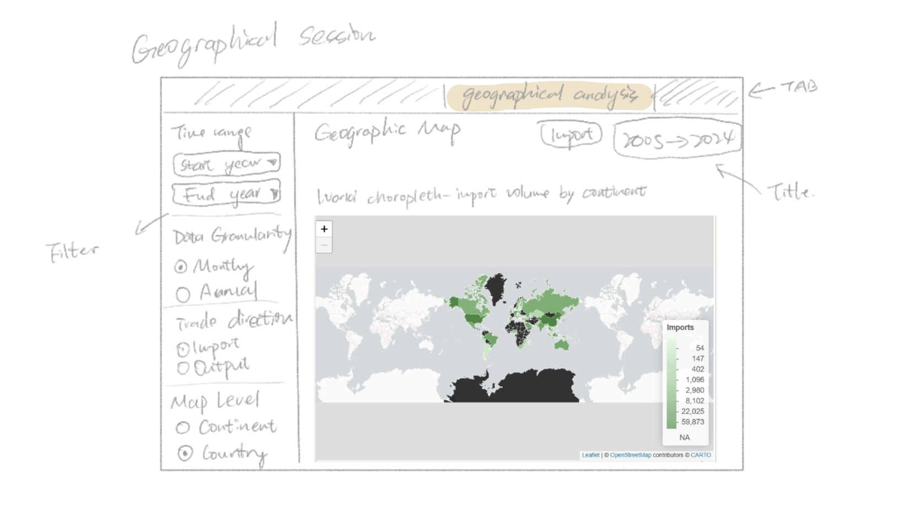
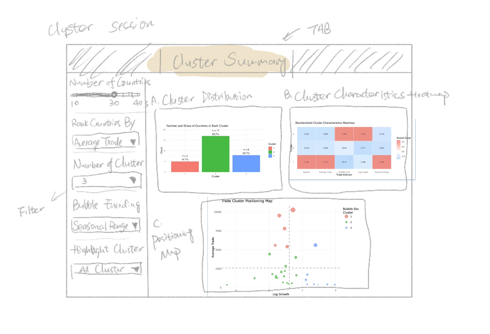
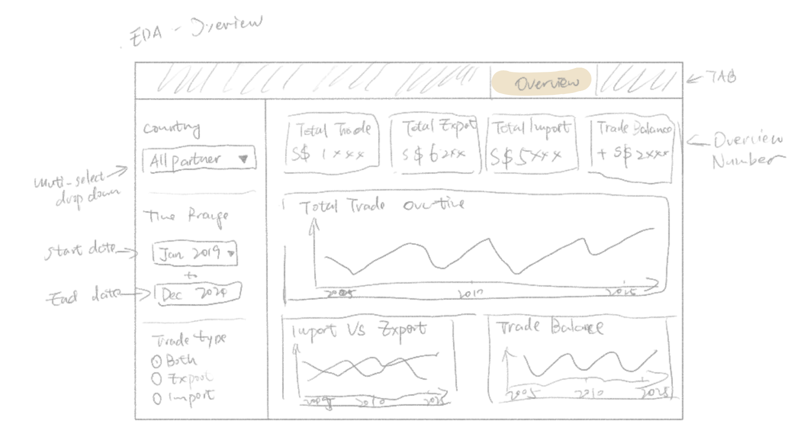
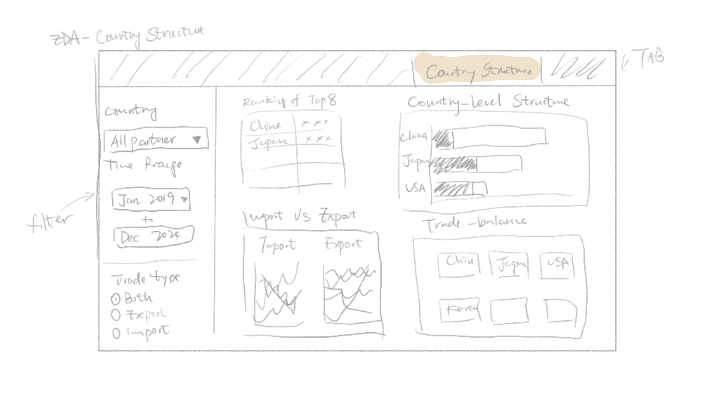
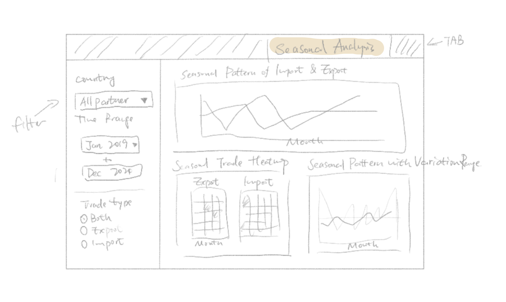
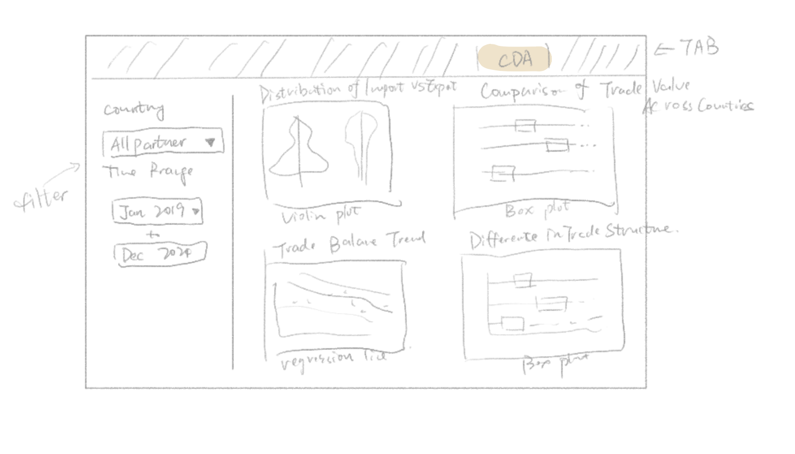

## **The Architecture of Trade: Discussing Singapore’s Import and Export Partner Ecosystem**

### What distinguishes Singapore’s core, emerging, and mainstream trading partners? Our team explores the structure, behaviour, and positioning of global trade relationships through visual analytics.

**Authors: Hao Zhiyi, Wu Yanjie, Fang Yu**

# **Overview & Motivation**

Singapore is a highly trade-dependent economy, and international trade plays a crucial role in its economic development. Analyzing Singapore’s import and export data across all trading partners from 2005 to January 2026 can help reveal long-term trade trends and the structure of its global trade relationships. By comparing the top import and export partners, this project focuses on the countries with the closest trade connections to Singapore, allowing for a clearer understanding of key bilateral trade patterns and their evolution over time.

# **Objectives**

The main objective of this project is to analyze Singapore’s international trade patterns using import and export data from 2005 to January 2026.

Specifically, the project aims to:

-   Examine overall trends in Singapore’s imports, exports, and total trade.

-   Identify Singapore’s major trading partners based on import and export rankings.

-   Conduct a focused analysis of the key countries with the strongest trade relationships with Singapore.

-   Present the findings through clear and informative data visualizations.

# **Data**

Data source: CEIC Database [https://insights-ceicdata-com.](https://insights-ceicdata-com./)

Singapore imports & exports datasets ,select countries which newest calue \> 10 SGD mn, this dataset consists of monthly import and export data from over 80 countries, five continents, and important political alliances from January 2005 to January 2026.

## **Data preparation:**

In the macro exploration of data, find the top 10 countries in Singapore's import and export volume rankings from 2005 to 2025. Identify the 8 countries that exist in both import and export as important trading partners and store them as the top 8data.xlsx for further analysis in "Exploratory and Confirmatory Analysis of Singapore’s Trade with Key Partners". Therefore, "Macro exploration and geographic analysis" uses import and export files to generate and analyze the top 8 data files, "trade cluster analysis" uses the top 30 countries in the import and export files for cluster analysis, and "Exploratory and Confirmatory Analysis of Singapore’s Trade with Key Partners " uses the top 8 data for EDA and CDA analysis.

# **Methodology & Analytical Approach**

For this project, the following approach will be taken by the team:

1.Macro exploration and geographical analysis:

-   Descriptive statistics:

    Min, Max, Mean, Standard deviation, Stability, Total growth,

    Distribution by continent: violin plot, box plot combined with raw scatter points

    Dynamic ranking bar chart

-   Geospatial Data Analysis:

    Interactive heat world map (country/continent)

    Trade Gravity Path

-   Prediction: used the ETS model to predict and visualize the import and export trends of our core trading partners for 11 months.

2\. Clustering Analysis:

This project adopts a clustering-based analytical approach to group Singapore’s trade partners according to their trade scale, growth, volatility, and seasonality. And applies k-means clustering on standardised variables to segment trade partners into meaningful groups.

-   Cluster Distribution Analysis: Use a bar chart to examine the number and share of countries in each cluster.
-   Cluster Characteristics Analysis: Use a standardised heatmap to compare the main features of each cluster across trade indicators.
-   Seasonal Pattern Analysis: Use monthly trade trend charts and seasonal heatmaps to examine differences in seasonal behaviour across clusters.
-   Positioning Analysis: Use a trade partner positioning map to visualise clusters based on Log Growth, Average Trade, and bubble size encoding.
-   Exploratory Data Analysis Confirmatory Data Analysis:

3.Exploratory Data Analysis

Explore the overall structure and trends of Singapore’s trade data. The analysis focuses on identifying general patterns in imports, exports, and total trade, as well as determining the major trading partners.

-   Trade Trend Analysis: Use time series visualisations to examine overall trends in Singapore’s imports, exports, and total trade from 2005 to January 2026.
-   Top Trading Partner Analysis: Compare the top import and export partners to identify the countries with the strongest trade relationships with Singapore.
-   Country-level Trade Analysis: Analyse the trade patterns of the selected key partner countries by comparing their import values, export values, and trade balance over time.
-   Seasonal Pattern Analysis: Use monthly trade trend charts and seasonal heatmaps to explore recurring seasonal patterns in Singapore’s trade activities.

4\. Confirmatory Data Analysis:

One-way ANOVA Test: Apply ANOVA to examine whether there are statistically significant differences in trade performance among Singapore’s major trading partners.

Regression Analysis: Use regression models to analyze the relationship between time and trade values, and to evaluate long-term trends in Singapore’s imports and exports.

Kruskal–Wallis Test: Use the Kruskal–Wallis test to assess whether there are statistically significant differences across clusters.(cluster)

Dunn’s Post-hoc Test: Where significant differences are found, use Dunn’s pairwise comparison test to identify which clusters differ significantly from each other.(cluster)

# **Prototype**

The team has decided to split the main prototype modules as follows:

::: panel
## Geographical analysis



This tab will serve as a geographical analysis of Singapore's global trade network for imports and exports.

Key features:

Interactive global heat map: used to display which regions have closer trade relations with Singapore and to find important trading partners.

Time selection module: Users can choose the start time and end time for statistics, or drag the timeline to view the continuous changes from 2005 to 2025.

Single selection tool: Select the data to generate the map 1. Monthly/Annual 2. Country/Continent 3. Import/Export.

## Cluster Analysis

 This tab will serve as a cluster overview dashboard within the R Shiny application, helping users understand how Singapore's major trading partners are grouped according to their trade characteristics.

Key features:

A cluster distribution map, displaying the number and percentage of countries in each cluster.

A cluster characteristic heatmap, comparing the standardized characteristics of each cluster across key trade indicators.

A trade partner positioning map, visualizing countries by logarithmic growth rate and average trade volume; bubble size represents the selected trade indicator.

An interactive filter panel, allowing users to adjust the number of countries, ranking criteria, number of clusters, bubble codes, and highlighted clusters.

Interactive elements will be implemented through filter controls and tooltips, enabling users to explore each country's clusters, trade size, growth rate, and seasonality.

## EDA Overview

 This tab provides an overall view of Singapore’s trade performance over time, allowing users to observe changes in total trade, imports, and exports.

Key Features：

KPI Indicators: Displays total trade, total exports, total imports, and trade balance to provide a quick summary of trade performance.

Total Trade Trend: Shows how Singapore’s total trade value changes over time.

Import vs Export Trend: Compares import and export values to highlight differences in trade patterns.

## EDA Country level analysis



This tab compares Singapore’s trade relationships across major trading partners and highlights differences in trade scale and structure.

Key Features:

Top Trading Countries: Ranks of countries based on total trade value.

Trade Structure by Country: Shows the composition of imports and exports for each country.

Country-Level Trade Trends: Displays how trade values with each country change over time.

## EDA seasonal level analysis



This tab examines whether Singapore’s trade activity varies across different months.

Key Features

Monthly Trade Pattern: Shows the average trade value for each month.

Seasonal Heatmap: Visualizes trade values across months and years using color intensity.

Trade Variation Range: Illustrates the variation range of trade values across different months.

## Confirmatory Data Analysis



This tab presents the confirmatory data analysis results to statistically examine the patterns observed in the exploratory analysis. It allows users to compare trade values across categories, countries, and months.

Import vs Export Distribution: Compares the distributions of import and export trade values using violin and box plots.

Trade Value by Country: Displays the distribution of trade values across different countries using boxplots.

Trade Balance Trend: Shows the relationship between trade balance and time using a scatter plot with a regression line.

Monthly Trade Comparison: Compares trade values across months to examine whether trade varies significantly during the year.
:::

# R Packages

Our team intends to use the following R packages to run the R Shiny Application:

readxl: A part of the tidyverse suite focused on importing data from Excel files (.xls and .xlsx).

tidyverse: a family of modern R packages specially designed to support data science, analysis and communication task including creating static statistical graphs.

knitr: an report generation tool.

dplyr: an R tool for working with data frame (e.g.objects).

plotly:R library for plotting interactive statistical graphs.

DT: an R interface to the JavaScript library DataTables that create interactive table on html page.

lubridate: an R package that facilitates to use of dates and time elements.

ggforce: an extension of ggplot2 to provide visual data analysis with newer stats and geoms.

highcharter: a wrapper that contains ‘highcharts’ library for plotting of R objects.

sf: an R package that supports the importing, managing, and processing of geospatial data.

spdep: an R package that supports the handling of geospatial data.

tmap: an R package that provides layer-based creation of thematic maps.

leaflet: an R package that allows the creation and customisation of interactive maps.

ggstatsplot: an extension of ggplot2 package for statistical visualisation and graphics creation.

ggdist: an R package that support visualisation of distribution and uncertainty.

Cluster: an R package that provides methods for cluster analysis, including partitioning and hierarchical clustering techniques.

gganimate: An extension of ggplot2 for creating animated statistical graphics (e.g., Bar Chart Race).

fable: An R package for forecasting and time series analysis using various statistical models like ETS and ARIMA.

tsibble: A specialized data frame for tidy temporal data, providing a foundation for time series analysis.

feasts: Tools for feature extraction and statistics of time series, used to visualize and analyze temporal patterns.

kableExtra: An extension of knitr for creating complex, highly customized static HTML tables.

countrycode: A utility for converting country names into standardized codes (like ISO-3) and vice versa.

rnaturalearth & rnaturalearthdata: Packages providing world map data and cultural boundaries for geographic visualization.

VennDiagram: A package specifically designed to generate high-resolution Venn diagrams to show intersections between sets.

scales: Provides methods for automatically determining breaks and labels for axes and legends.

ggthemes & hrbrthemes: Collections of additional themes and scales for ggplot2 to enhance chart aesthetics.

transformr & gifski: Supporting packages for gganimate to handle smooth transitions and render high-quality GIF files.

# **Project Schedule**

Below is an overview of our project timeline. For detailed list of task, please refer to gantt chart submitted.

```{r}
#| code-fold: true
#| code-summary: "Show code"
library(tidyverse)

# 任务数据
tasks <- tibble(
  task = c(
    "Data Collection",
    "Data Cleaning",
    "Exploratory Analysis",
    "Cluster Analysis",
    "Geographical Analysis",
    "Project Proposal",
    "R Quarto Website",
    "R Shiny App",
    "Storyboard / Prototype",
    "Poster"
  ),
  start = as.Date(c(
    "2026-02-24",
    "2026-02-25",
    "2026-02-26",
    "2026-02-26",
    "2026-02-26",
    "2026-02-27",
    "2026-03-01",
    "2026-02-25",
    "2026-03-10",
    "2026-03-20"
  )),
  end = as.Date(c(
    "2026-02-26",
    "2026-02-26",
    "2026-02-27",
    "2026-03-10",
    "2026-03-12",
    "2026-03-15",
    "2026-03-15",
    "2026-03-22",
    "2026-03-28",
    "2026-04-01"
  )),
  status = c(
    "Completed",
    "Completed",
    "Completed",
    "Completed",
    "Completed",
    "In progress",
    "In progress",
    "In progress",
    "In progress",
    "In progress"
  )
)

# 为了让任务从上到下显示
tasks$task <- factor(tasks$task, levels = rev(tasks$task))

ggplot(tasks) +
  geom_segment(
    aes(x = start, xend = end, y = task, yend = task, color = status),
    linewidth = 6
  ) +
  geom_vline(
    xintercept = as.Date("2026-04-01"),
    color = "#E67E22",
    linetype = "dashed",
    linewidth = 1
  ) +
  annotate(
    "text",
    x = as.Date("2026-04-01"),
    y = 1,
    label = "Final Due\n01 Apr",
    color = "#E67E22",
    hjust = -0.1,
    vjust = -0.5,
    size = 4
  ) +
  scale_color_manual(
    values = c(
      "Completed" = "#2C3E50",
      "In progress" = "#E67E22"
    )
  ) +
  labs(
    title = "Project Timeline",
    x = "Date",
    y = NULL,
    color = NULL
  ) +
  theme_minimal(base_size = 12) +
  theme(
    legend.position = "top",
    panel.grid.minor = element_blank(),
    axis.text.y = element_text(face = "bold")
  )
```
