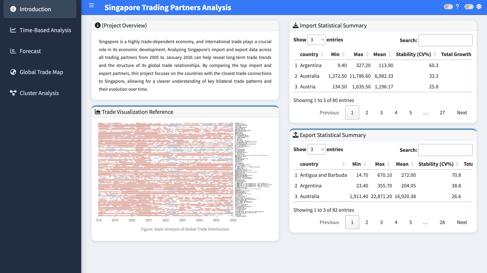
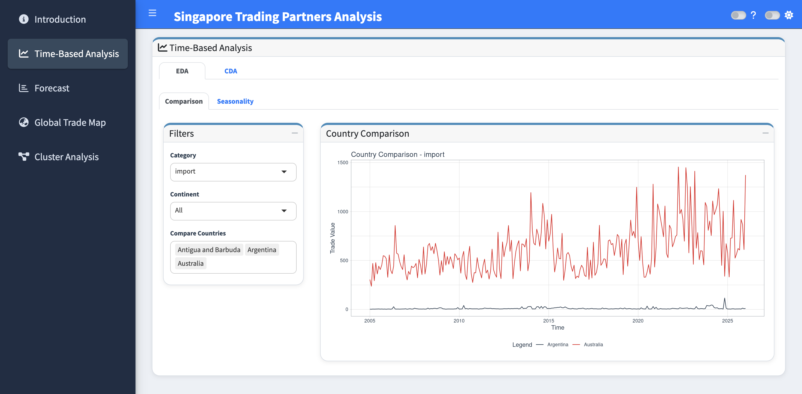
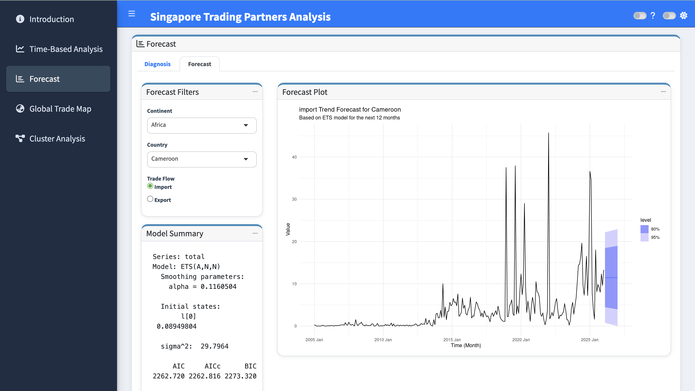
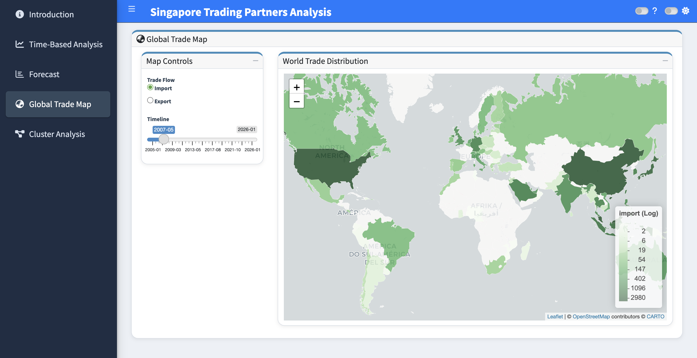
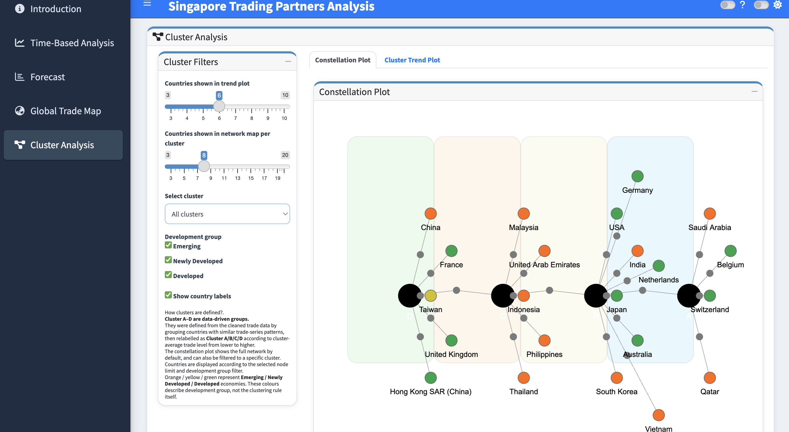
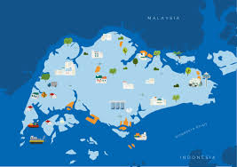

---
format: 
  html:
   page-layout: full
resources:
  - image/strait.jpg
---


```{r}
#| echo: false
#| message: false
#| warning: false
library(bslib)
library(htmltools)
```


<div id="introduction"></div>
<div class="intro-fullwidth intro-hero">


<div style="text-align: center; padding:60px 20px 0px 20px; background-color: #ffffff; font-family: 'Segoe UI', Arial, sans-serif;"> 

<div style="display: flex; align-items: center; justify-content: center; margin-bottom: 20px;">
<div style="width: 40px; height: 1.5px; background: #1abc9c; margin-right: 15px;"></div>
<h2 style="font-weight: bold; letter-spacing: 2px; font-size: 1.4rem; color: #333; margin: 0; border: none;">INTRODUCTION</h2>
<div style="width: 40px; height: 1.5px; background: #1abc9c; margin-left: 15px;"></div>
</div>


<div style="color: #666; font-size: 1.05rem; line-height: 1.8; max-width: 850px; margin: 0 auto; text-align: left;">
  <p style="margin-bottom: 1.5rem;">
    Singapore is a highly trade-dependent economy, and international trade plays a crucial role in its economic development.
  </p>
  <p style="margin-bottom: 1.5rem;">
    Analyzing Singapore’s import and export data across all trading partners from 2005 to January 2026 can help reveal long-term trade trends and the structure of its global trade relationships.
  </p>
  <p>
    By comparing the top import and export partners, this project focuses on the countries with the closest trade connections to Singapore, allowing for a clearer understanding of key bilateral trade patterns and their evolution over time.
  </p>
</div>
</div>


<div style="text-align: center; padding-top: 0px;">
<h2 style="font-weight: bold; letter-spacing: 2px; font-size: 1.5rem;">KEY FIGURES</h2>
<p style="color: #666; font-size: 0.9rem;">The team conducted data visualization and analysis from overall to important trading partners.</p>
</div>

::: {.column-screen style="background: linear-gradient(rgba(0,0,0,0.7), rgba(0,0,0,0.7)), url('./image/strait.jpg'); background-size: cover; background-position: center; padding: 60px 0; color: white; margin-top: 20px;"}

<div style="display: flex; justify-content: space-around; text-align: center; max-width: 1100px; margin: 0 auto; flex-wrap: wrap;">
<div class="stat-box">
<i class="fa-solid fa-globe"></i>
<div class="stat-value">102</div>
<div class="stat-label">Countries</div>
<div class="stat-sub">Total Partners</div>
</div>
<div class="stat-box">
<i class="fa-solid fa-wallet"></i>
<div class="stat-value" style="font-size: 1.8rem;">10,944,598.4 <small style="font-size: 0.9rem;">mil</small></div>
<div class="stat-label">Import Trade Volume</div>
<div class="stat-sub">Units: S$ Million</div>
</div>
<div class="stat-box">
<i class="fa-solid fa-tags"></i>
<div class="stat-value" style="font-size: 1.8rem;">11,935,800.7 <small style="font-size: 0.9rem;">mil</small></div>
<div class="stat-label">Export Trade Volume</div>
<div class="stat-sub">Units: S$ Million</div>
</div>
<div class="stat-box">
<i class="fa-solid fa-briefcase"></i>
<div class="stat-value">21 years</div>
<div class="stat-label">2005-2025</div>
<div class="stat-sub">Analysis Span</div>
</div>
</div>
:::

## {#rshiny-app .unnumbered}

<div class="custom-section-header">
  <h2 class="custom-section-title">RSHINY APP</h2>
  <p class="custom-section-subtitle">
    Explore the interactive dashboard through key analytical modules.<br>
    Click any preview to open the full Shiny app.
  </p>
</div>

<div class="shiny-filter-row">
  <span class="shiny-filter active">ALL</span>
  <span class="shiny-filter">HOME</span>
  <span class="shiny-filter">TIME-BASED</span>
  <span class="shiny-filter">FORECAST</span>
  <span class="shiny-filter">MAP</span>
  <span class="shiny-filter">CLUSTER</span>
</div>

::: {.shiny-gallery-grid}

::: {.shiny-gallery-card}
[{.shiny-gallery-image}](https://yanjie-isss608.shinyapps.io/Singapore-Trading/){target="_blank"}
<div class="shiny-gallery-title">Home / Introduction</div>
<div class="shiny-gallery-text">Project overview, trade context, and statistical summary tables.</div>
:::

::: {.shiny-gallery-card}
[{.shiny-gallery-image}](https://yanjie-isss608.shinyapps.io/Singapore-Trading/){target="_blank"}
<div class="shiny-gallery-title">Time-Based Analysis</div>
<div class="shiny-gallery-text">Explore temporal trade patterns and long-term movement across partner countries.</div>
:::

::: {.shiny-gallery-card}
[{.shiny-gallery-image}](https://yanjie-isss608.shinyapps.io/Singapore-Trading/){target="_blank"}
<div class="shiny-gallery-title">Forecast</div>
<div class="shiny-gallery-text">Inspect projected trade trends and future movement patterns.</div>
:::

::: {.shiny-gallery-card}
[{.shiny-gallery-image}](https://yanjie-isss608.shinyapps.io/Singapore-Trading/){target="_blank"}
<div class="shiny-gallery-title">Global Trade Map</div>
<div class="shiny-gallery-text">Visualise Singapore’s trade network and geographic distribution.</div>
:::

::: {.shiny-gallery-card}
[{.shiny-gallery-image}](https://yanjie-isss608.shinyapps.io/Singapore-Trading/){target="_blank"}
<div class="shiny-gallery-title">Cluster Analysis</div>
<div class="shiny-gallery-text">Compare countries based on similarity in time-series trade behaviour.</div>
:::

:::

<div class="center-btn">
  <a href="https://yanjie-isss608.shinyapps.io/Singapore-Trading/" target="_blank" class="hero-btn">
    Launch RShiny App
  </a>
</div>

## Project Journey {#project-journey .section-title}

::: {.section-intro}
Proposal and meeting records that document the evolution of the project.
:::

::: {.columns}

::: {.column width="25%"}
::: {.card .journey-card}
### Proposal

📄

Initial project scope, motivation, and analytical plan.

[Open](Proposal.qmd){.hero-btn}
:::
:::

::: {.column width="25%"}
::: {.card .journey-card}
### Minutes 1

📝

Initial discussion on dataset scope and analytical direction.

[Open](files/Minutes-20260317.pdf){.hero-btn target="_blank"}
:::
:::

::: {.column width="25%"}
::: {.card .journey-card}
### Minutes 2

📝

Method refinement after professor feedback and DTW update.

[Open](files/Minutes-20260330.pdf){.hero-btn target="_blank"}
:::
:::

::: {.column width="25%"}
::: {.card .journey-card}
### Minutes 3

📝

Final integration, UI/UX polishing, and deployment planning.

[Open](files/Minutes-20260403.pdf){.hero-btn target="_blank"}
:::
:::

:::

## Team {#team .section-title}


::: {.section-intro}
The project was developed collaboratively, with each member contributing to a different analytical component.
:::

::: {.columns}

::: {.column width="33%"}
::: {.card .team-card}


#### Hao Zhiyi

MITB AI track
:::
:::

::: {.column width="33%"}
::: {.card .team-card}


#### Wu Yanjie

MITB DT track
:::
:::

::: {.column width="33%"}
::: {.card .team-card}


#### Fang Yu

MITB AI track
:::
:::

:::

## {#poster .unnumbered}

::: {.poster-section}
::: {.poster-section-inner}

### POSTER {.poster-heading}

::: {.poster-subtitle}
One glance view of the entire project
:::

[{.poster-large-image}](files/VAA-Poster.pdf)

:::
:::


## {#contact .unnumbered}

<div class="custom-section-header">
  <h2 class="custom-section-title">CONTACT US</h2>
  <p class="custom-section-subtitle">
    If you have any feedback, drop us a note!
  </p>
</div>

::: {.contact-showcase}

::: {.contact-image-panel}

:::

::: {.contact-form-panel}

::: {.fake-input}
Name
:::

::: {.fake-input}
Email
:::

::: {.fake-textarea}
Message
:::

<div class="contact-btn-row">
  <a href="mailto:zhiyi.hao.2025@mitb.smu.edu.sg" class="contact-send-btn">SEND</a>
</div>

:::

:::